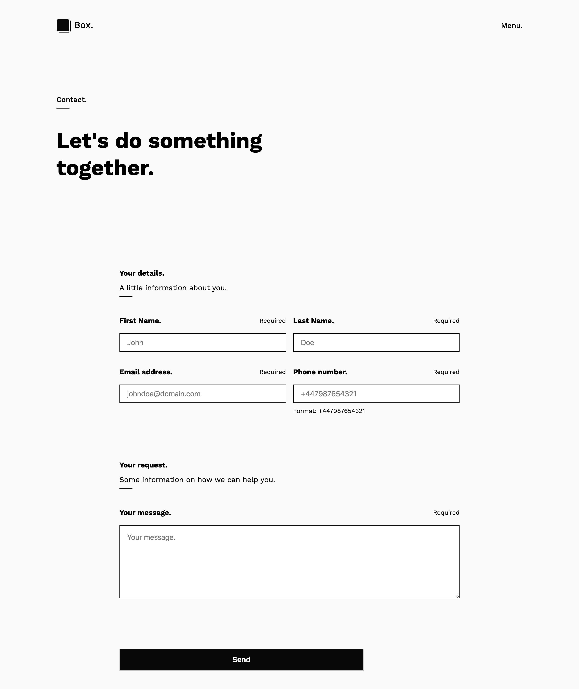

# **JS-FORM-VALIDATION**
JS-form-validation is a personal project I created to practice:
* Constraint validation API.
* Built-in form validation using HTML5 features.



## **Getting started**
Instructions on how to get you a copy of the project up and running on your local machine.

### **Technologies/tools**
The project has been created using HTML5, SCSS and vanilla JS.

I used Babel and NPM to run the project and install any dependency.

### **Installing**
1. Clone the repository to your local machine or download the project files.
2. Install project dependencies, e.g.
```
npm install
```

### **How to use it**
There are two branches for this project:
1. Master branch uses the Constraint API to validate the form
2. Built-in-validation uses HTML5 features only to validate the form.
